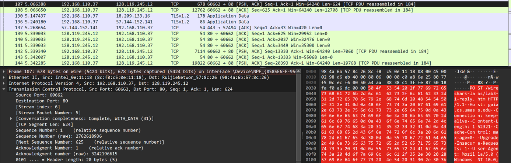

Question below are based on the trace file tcp-ethereal-trace-1 in in http://gaia.cs.umass.edu/wireshark-labs/wireshark-traces.zip

Answer the following questions for the TCP segments:

1. What is the IP address and TCP port number used by your client computer (source) to transfer the file to gaia.cs.umass.edu? (10%)

2. What does gaia.cs.umass.edu use the IP address and port number to receive the file. (Attach the screenshot of your Wireshark's display) (10%)

3. What is the sequence number of the TCP SYN segment that is used to initiate the TCP connection between the client computer and gaia.cs.umass.edu?
   What is it in the segment that identifies the segment as a SYN segment? (Attach the screenshot of your Wireshark's display) (10%)

4. What is the sequence number of the SYNACK segment sent by gaia.cs.umass.edu to the client computer in reply to the SYN?
   What is the value of the ACKnowledgement field in the SYNACK segment? How did gaia.cs.umass.edu determine that value? 
   What is it in the segment that identifies the segment as a SYNACK segment? (Attach the screenshot of your Wireshark's display) (10%)

5. What is the sequence number of the TCP segment containing the HTTP POST command? Note that in order to find the POST command,
   you’ll need to dig into the packet content field at the bottom of the Wireshark window, looking for a segment with a “POST” 
   within its DATA field.(Attach the screenshot of your Wireshark's display) (15%)

6. Consider the TCP segment containing the HTTP POST as the first segment in the TCP connection.
   What are the sequence numbers of the first six TCP connection segments (including the HTTP POST segment)? 
   At what time was each segment sent? When was the ACK for each segment received? Given the difference between when each TCP segment was sent, 
   and when its acknowledgement was received, what is the RTT value for each of the six segments? What is the EstimatedRTT value 
   (see page 237 in textbook) after the receipt of each ACK? Assume that the value of the EstimatedRTT is equal to the measured RTT 
   for the first segment, and then is computed using the EstimatedRTT equation on page 237 for all subsequent segments. (30%) 
   Note: Wireshark has a nice feature that allows you to plot the RTT for each of the TCP segments sent. Select a TCP segment in the
   “listing of captured packets” window that is being sent from the client to the gaia.cs.umass.edu server. Then select: Statistics->
   TCP Stream Graph->Round Trip Time Graph.

7. What is the length of each of the first six TCP segments?(Attach the screenshot of your Wireshark's display) (15%).

# ANSWERS
Q#1: Answer

IP address and TCP port numbers of the client computer (source).
Source IP Address          : 192.168.110.37
Source Port                     : 60662

Q#2: Answer

IP address and TCP port numbers of  gaia.cs.umass.edu.
Destination Port         : 128.119.245.12
Destination Port         : 80

The server's domain name is gaia.cs.umass.edu. This domain name is converted into a numerical IP address by the Domain Name System (DNS), allowing computers to find and connect to the server.

Q#3 Answer

SEQUENCE NUMBER: 637617485
      To determine the sequence number of the TCP SYN segment and identify the segment as a SYN segment in Wireshark, follow these steps:
      Steps:
1.	Capture the Traffic Using Wireshark:
Open Wireshark .
Start a capture on network interface .
Initiate the file transfer.
2.	Filter the Traffic:
Once the traffic is captured, use a display filter to focus on the TCP connection. Enter tcp in the Wireshark filter bar:
3.	Locate the SYN Packet:
The TCP handshake starts with a SYN packet from the client to the   server. Look for the first packet with the SYN flag set.
Identify the SYN packet by checking for SYN in the Flags field in the Wireshark details pane.
4.	Examine the SYN Packet:
			Click on the SYN packet in the Wireshark capture.
In the Packet Details pane, expand the Transmission Control Protocol   (TCP) section.
			Look for the Sequence Number field. 
5.	Identify the SYN Flag:
In the TCP Flags section, check for the SYN flag. This is what marks the segment as a SYN segment.
The SYN segment is always the first segment , and it is the packet where the SYN flag is set to 1.

ACK value for SYN + ACK is equal to sequence number of next ACK segment as shown in below figures.

Q#4 Answer

SYN-ACK Segment from the Server:
The next step in the three-way handshake is the SYN-ACK segment sent by gaia.cs.umass.edu in reply to the client’s SYN packet.
In Wireshark, look for the SYN-ACK segment. This segment will have both the SYN and ACK flags set to 1.
	Examine the SYN-ACK Segment in Wireshark:
Click on the SYN-ACK segment in Wireshark to view its details in the Packet   Details panen see the following in the figure given below:
i.	Sequence Number
ii.	ACKnowledgement Number
iii.	SYN and ACK flags: The SYN and ACK flags will be set to 1 in the segment to identify it as a SYN-ACK.

Q#5 Answer

Sequence Number: This is the number in the TCP header that identifies the first byte of data in the packet (where the POST command starts).
POST Command: The packet content will have POST in the HTTP section, indicating the HTTP POST request.
Data Field: The body of the POST request will appear in the Packet Bytes section.
Flags: The TCP flags will likely indicate the state of the connection (e.g., PSH for pushing data, ACK for acknowledgment).
Sequence Number              :  2762618936 
Acknowledgment Number :  3242196615

Q#6 Answer

[17 Reassembled TCP Segments (152945 bytes): #107(624), #108(12708), #142(7060), #144(19768), #151(2824), 
#154(11296), #156(2824), #158(5648), #160(2824), #163(28240), #167(2824), #169(1412), #172(21180), #175(2824), #178(5648), #183(20376)]

At what time was each segment sent?

Time Sent         : 5.066388
Time Received : 5.066650

RTT= Receive time  -    Sent time
RTT=5.066650         -   5.066388
RTT=0.000262

Graph

Q#7 Answer

TCP segemt data 624 bytes.
Length of segments:

